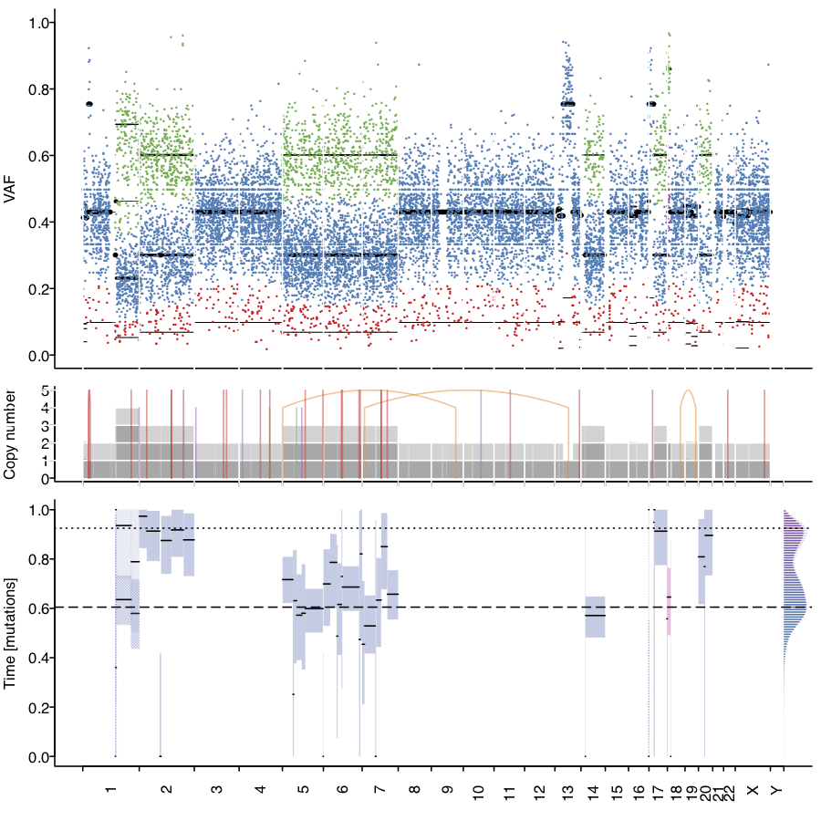

# MutationTime.R
MutationTime.R is an R script to time somatic mutations relative to clonal and subclonal copy number states and calculate
the relative timing of copy number gains.
It has been used by the PCAWG consortium to calculate mutation times of 2,778 whole genome sequencing samples. http://dx.doi.org/10.1101/161562	

MutationTime.R needs the following input objects
```{R}
source("MutationTime.R")
vcf <- readVcf("myvcf.vcf") # Point mutations, needs info columns t_alt_count t_ref_count
bb <- GRanges(, major_cn= , minor_cn=, clonal_frequency=purity) # Copy number segments, needs columns  major_cn, minor_cn and clonal_frequency of each segment
```

To run MutationTime.R
```{R}
mt <- mutationTime(vcf, bb)
```

Mutation Annotation
```{R}
head(param$D)
```

Classify as basic clonal states
```{R}
table(classifyMutations(mt$D))
```

Time of copy number gains
```{R}
bb$timing_param <- mt$P
bbToTime(bb)
```

